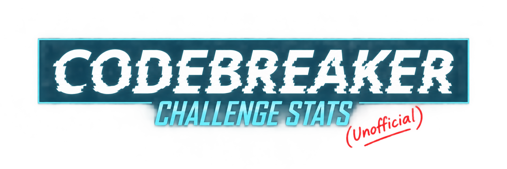
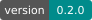

<p align="center">
  <a href="#get-started"></a>
  <a href="https://github.com/XSS3cut10n3r/CBC_Scraper-Rebuilt/actions/workflows/tests.yml"></a>
  <a href="pyproject.toml"></a>
  <a href="COPYING"></a>
</p>

Based on [code-zm/cbc_scraper](https://github.com/code-zm/cbc_scraper). Thank you to [code-zm](https://github.com/code-zm) for creating the original project.

School leaderboards, fastest first solves, and your personal task times in the terminal.

## Get started

```sh
python -m venv .venv
source .venv/bin/activate
pip install -e .
cbc-scraper
```

Choose **5. Set up / refresh browser login** from the menu. This creates `edit_this_request.txt` for you.

Open `edit_this_request.txt` and follow its comments to copy your browser's **Cookie** header. Paste it where indicated and save. The scraper finds it automatically. This file is ignored by Git. You can also paste a full **Copy as cURL** request there, replacing the Cookie line.

To refresh an expired login, choose **5** again and replace the cookies in the same file. Existing contents are preserved.

## Shortcuts

```sh
cbc-scraper submissions                       # Your attempts and times
cbc-scraper leaderboard --task 'Task 8'       # Earliest school solves
cbc-scraper leaderboard --school 'Georgia'   # Filter schools
cbc-scraper offline                           # All saved results, offline
cbc-scraper history                           # Browse submission text by task
```

Submission history shows the submitted content and API response, earliest first, in pages of 20. Select an entry number to read long text in full. Use `cbc-scraper history --display` to browse saved submissions offline.

**Solve Time** runs from the previous task's last submission to the current task's last submission. **Total** starts at your first task0 submission. Times include breaks; submissions are approximate completion markers.

More options: `cbc-scraper --help`. Login files and results stay local and are excluded from Git.

[GPL-3.0-or-later](COPYING).

## Non-affiliation notice

CBC Scraper Rebuilt is an independent, unofficial project. Neither this project nor its maintainers are affiliated with, sponsored by, endorsed by, or acting on behalf of the United States National Security Agency (NSA). This software and its accompanying documentation are not authored, published, distributed, approved, or supported by the NSA. References to the NSA, the Codebreaker Challenge, and associated names, logos, or imagery identify the challenge this tool supports and do not imply official status, authorization, or endorsement.
